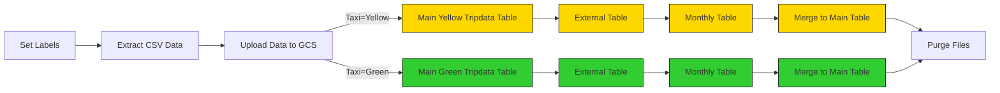

# The solution was based on ETL Pipelines in Kestra: Google Cloud Platform
## Step 1: Creat an VM machine on GCP
### Project infrastructure modules in GCP:
* Google Cloud Storage (GCS): Data Lake
* BigQuery: Data Warehouse

(Concepts explained in Week 2 - Data Ingestion)

### Initial Setup

For this course, we'll use a free version (upto EUR 300 credits). 

1. Create an account with your Google email ID 
2. Setup your first [project](https://console.cloud.google.com/) if you haven't already
    * eg. "DTC DE Course", and note down the "Project ID" (we'll use this later when deploying infra with TF)
3. Setup [service account & authentication](https://cloud.google.com/docs/authentication/getting-started) for this project
    * Grant `Viewer` role to begin with.
    * Download service-account-keys (.json) for auth.
4. Download [SDK](https://cloud.google.com/sdk/docs/quickstart) for local setup
5. Set environment variable to point to your downloaded GCP keys:
   ```shell
   export GOOGLE_APPLICATION_CREDENTIALS="<path/to/your/service-account-authkeys>.json"
   
   # Refresh token/session, and verify authentication
   gcloud auth application-default login
   ```
   
### Setup for Access
 
1. [IAM Roles](https://cloud.google.com/storage/docs/access-control/iam-roles) for Service account:
   * Go to the *IAM* section of *IAM & Admin* https://console.cloud.google.com/iam-admin/iam
   * Click the *Edit principal* icon for your service account.
   * Add these roles in addition to *Viewer* : **Storage Admin** + **Storage Object Admin** + **BigQuery Admin**
   
2. Enable these APIs for your project:
   * https://console.cloud.google.com/apis/library/iam.googleapis.com
   * https://console.cloud.google.com/apis/library/iamcredentials.googleapis.com
   
3. Please ensure `GOOGLE_APPLICATION_CREDENTIALS` env-var is set.
   ```shell
   export GOOGLE_APPLICATION_CREDENTIALS="<path/to/your/service-account-authkeys>.json"
   ```
## Step 2: ETL Pipelines in Kestra: Google Cloud Platform
### Setup Google Cloud Platform (GCP)

Before we start loading data to GCP, we need to set up the Google Cloud Platform. 

First, adjust the following flow [`04_gcp_kv.yaml`](flows/04_gcp_kv.yaml) to include your service account, GCP project ID, BigQuery dataset and GCS bucket name (_along with their location_) as KV Store values:
- GCP_CREDS
- GCP_PROJECT_ID
- GCP_LOCATION
- GCP_BUCKET_NAME
- GCP_DATASET.


> [!WARNING]  
> The `GCP_CREDS` service account contains sensitive information. Ensure you keep it secure and do not commit it to Git. Keep it as secure as your passwords.

### Create GCP Resources

If you haven't already created the GCS bucket and BigQuery dataset in the first week of the course, you can use this flow to create them: [`05_gcp_setup.yaml`](flows/05_gcp_setup.yaml).


### GCP Workflow: Load Taxi Data to BigQuery



The flow code: [`06_gcp_taxi.yaml`](flows/06_gcp_taxi.yaml).

### GCP Workflow: Schedule and Backfill Full Dataset

We can now schedule the same pipeline shown above to run daily at 9 AM UTC for the green dataset and at 10 AM UTC for the yellow dataset. You can backfill historical data directly from the Kestra UI.

Since we now process data in a cloud environment with infinitely scalable storage and compute, we can backfill the entire dataset for both the yellow and green taxi data without the risk of running out of resources on our local machine.

The flow code: [`06_gcp_taxi_scheduled.yaml`](flows/06_gcp_taxi_scheduled.yaml).
